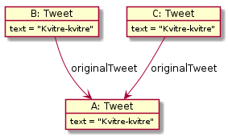

# Objektstrukturer - Twitter-oppgave

Denne oppgaven handler om en begrenset klone av `Twitter`, med to klasser, `TwitterAccount` og `Tweet`.

En Twitter-konto kan følge andre Twitter-kontoer og motsatt: en Twitter-konto kan bli fulgt av andre Twitter-kontoer.
Dette er altså en gjensidig kobling: Hvis konto A følger konto B, så er konto B fulgt av konto A. En kan selvsagt ikke følge seg selv.

I tillegg har hver Twitter-konto en mengde _tweets_, som er små, korte tekster. En tweet hører til den kontoen den ble sendt fra.
Hvis noen finner en annen sin tweet interessant har man muligheten til å retweete denne. Da lager man en tweet som refererer til originalen,
og (implisitt) få original-tweeten sin tekst. Merk at i en kjede av retweets, så vil alle referere til samme original-tweet. Mao.,
hvis tweet B er en retweet av A og tweet C er en retweet av B, vil både tweet B og C ha A som original-tweet, slik det er vist under.

**Riktig objektstrutur**, når B er en retweet av A og C er en retweet av B:

**Feil objektstrutur**, når B er en retweet av A og C er en retweet av B:

## Tweet-klassen

`Tweet` skal ha to konstruktører, en for hver måte å tweete på:

- `Tweet(TwitterAccount, String)` - En ny original-tweet
- `Tweet(TwitterAccount, Tweet)` - En retweet av Tweet-argumentet. Utløser et passende unntak, hvis original-tweeten er fra samme konto.

`Tweet` skal ha metodene:

- `String getText()` - returnerer teksten til en tweet
- `TwitterAccount getOwner()` - returnerer kontoen som tweeten kom fra
- `Tweet getOriginalTweet()` - returnerer original-tweeten, hvis den er en retweet, ellers null
- `int getRetweetCount()` - returnerer antall ganger denne tweeten har blitt retweetet

## TwitterAccount-klassen

`TwitterAccount` skal ha konstruktøren:

- `TwitterAccount(String)` - som tar inn brukernavnet

`TwitterAccount` skal ha metodene:

- `String getUserName()` - returnerer brukernavnet
- `void follow(TwitterAccount account)` - denne (this) kontoen starter å følge account
- `void unfollow(TwitterAccount account)` - slutt å følge account
- `boolean isFollowing(TwitterAccount account)` - returnerer om denne kontoen følger account
- `boolean isFollowedBy(TwitterAccount account)` - returnerer om account følger denne kontoen
- `void tweet(String)` - lager en ny tweet for denne kontoen
- `void retweet(Tweet tweet)` - retweeter tweet fra denne kontoen
- `Tweet getTweet(int i)` - returner tweet nummer i, der 1 er den nyeste, 2 den nest nyeste, … (merk rekkefølgen!)
- `int getTweetCount()` - returner antall tweets til kontoen
- `int getRetweetCount()` - returner antall retweets av tweets fra denne kontoen

## Del 1

- Implementer `Tweet`-klassen.
- For å teste klassen må du sende inn TwitterAccount-objekter i konstruktøren. Lag en forenklet versjon av `TwitterAccount`-klassen
  for dette formålet, der du kun implementerer konstruktøren og evt. en passende toString(). Dette gjør det mulig å teste `Tweet`-klassen
  din uten at du må implementere hele `TwitterAccount`-klassen først.

## Del 2

- Implementer `TwitterAccount`-klassen.
- Test klassen og dens samspill med `Tweet`-klassen ved å lage Twitter-konto for deg selv og noen av vennene dine.
  La noen av kontoene følge hverandre, tweete og retweete.

Testkode for denne oppgaven finner du her: [oving4/TweetTest.java](../../src/test/java/oving4/TweetTest.java) og [oving4/TwitterAccountTest.java](../../src/test/java/oving4/TwitterAccountTest.java).

## Frivillig utvidelse

På Twitter kan man markere en annen sin tweet som en favoritt. Implementer passende metoder for å kunne gjøre dette.
En konto må ha oversikt over hvilke tweets den har markert som favoritter, og en tweet må vite hvem og hvor mange som har markert den
som favoritt. Hva synes du burde skje hvis man markerer en retweet som en favoritt?
