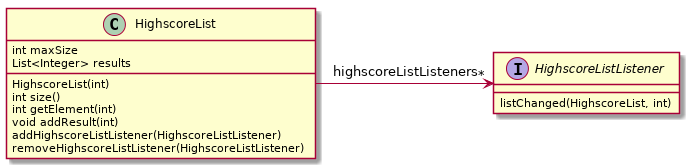
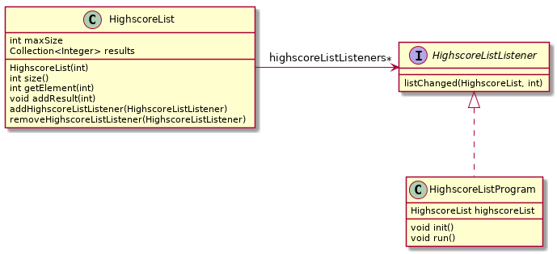

# Observatør-observert-teknikken - HighscoreList-oppgave

Denne oppgaven handler om å bruke observatør-observert-teknikken for å bli informert om endringer i en highscore-liste.

Observatør-observert-teknikken går ut på at det observerte objektet sier ifra til en eller flere observatører om at tilstanden er endret. Dette brukes gjerne når vi har en rekke observatørobjekter som ønsker å vite når en endring skjer i et annet (observert) objekt. Det hadde vært ueffektivt om observatørobjektene skulle sjekket for endringer hele tiden. Derfor definerer vi ofte et felles `interface` som disse kan implementere, slik at det observerte objektet kan kalle på metoder i observatørene når det skjer en endring.

I denne oppgaven skal vi lage en observerbar **HighscoreList** som kan si fra til observatører/lyttere av typen **HighscoreListListener** når nye resultater blir registrert. En hovedprogramklasse kalt **HighscoreProgram** vil bli brukt til å sjekke at det virker. Denne klassen oppretter en **HighscoreList**-instans, legger inn resultater (tall) fra konsollen som legges til lista og skriver ut lista hver gang et nytt resultat faktisk blir lagt til.

Alle filene i denne oppgaven skal lages i [oving6/observable](../../src/main/java/oving6/observable)

## Del 1: Implementasjon av HighscoreList

En **HighscoreList** skal holde styr på heltallsresultater (av typen int/Integer). Lista skal være observerbar ved at den kan registrere lyttere (**HighscoreListListener**-instanser) og si fra til dem når lista blir endret. Lista skal ha en maksimal lengde, som settes i konstruktøren, f.eks. skal en topp 10-liste kunne opprettes med `new HighscoreList(10)`. Nye resultater registreres med metoden `addResult(int)`, som skal finne riktig posisjon og legge resultatet inn (dersom det er godt nok). Dersom lista er for lang, så skal det dårligste resultatet fjernes. NB: _Lavest verdi_ er best, f.eks. antall sekunder på en oppgave eller antall flytt i Sokoban.

**HighscoreListListener**-grensesnittet er vist i klassediagrammet til venstre og må implementeres av alle klasser som ønsker å fungere som lyttere for **HighscoreList**-instanser. Lyttere registrerer seg med **HighscoreList** sin **addHighscoreListListener**-metode og vil siden få beskjed om nye resultater ved at **listChanged**-metoden kalles. Argumentene som tas inn er **HighscoreList**-objektet som ble endret og posisjonen i lista der endringen skjedde.

Her er en oversikt over metoden som må implementeres:

- `HighscoreList(int maxSize)` - konstruktøren tar inn maks antall resultater som lista skal kunne holde. Denne verdien må brukes av **addResult**, slik at resultater som er for dårlige kastes.
- `size()` - returnerer antall elementer i lista, som altså aldri skal overstige maks-antallet
- `int getElement(int)` - returnerer resultatet i posisjonen angitt av argumentet
- `void addResult(int)` - registrere et nytt resultat, og dersom resultatet er godt nok til å komme med på lista, så legges det inn på riktig plass. Dersom lista blir for lang, så må dårligste resultat kastes. Alle registrerte lyttere må få beskjed om en evt. endring av lista, inkludert på hvilken posisjon som ble endret.
- `addHighscoreListListener(HighscoreListListener)` - registrerer en ny lytter
- `removeHighscoreListListener(HighscoreListListener)` - fjerner en tidligere registrert lytter

Klassediagram for **HighscoreList** og **HighscoreListListener**:

Testkode for denne oppgaven finner du her: [oving6/observable/HighscoreListTest.java](../../src/test/java/oving6/observable/HighscoreListTest.java).

## Del 2: Hovedprogramklasse

Lag en hovedprogramklasse kalt **HighscoreListProgram**, som tester at **HighscoreList**-klassen din virker som den skal. La den opprette en **HighscoreList**-instans, lese inn tall fra konsollet (f.eks. med en `Scanner` og `nextInt`-metoden) og legge disse inn i lista. Sørg for at **HighscoreListProgram** implementerer **HighscoreListListener**-grensesnittet (`HighscoreListProgram implements HighscoreListListener`) og registrerer seg som lytter på **HighscoreList**-instansen via `addHighscoreListListener`. La lyttermetoden `listChanged` skrive ut informasjon og resultatene i **HighscoreList**-instansen og posisjonsargumentet, slik at du ser at alt virker som det skal.

Vi foreslår følgende metoder og oppførsel:

- `void init()` - oppretter en ny **HighscoreList** og registrerer seg selv (altså **HighscoreListProgram**-instansen) som lytter. Dette kan og gjøres i konstruktøren om ønskelig
- `void run()` - leser inn tall (resultater) fra terminalen og legger dem til i listen
- `void listChanged(HighscoreList, int)` (fra `HighscoreListListener`) - observerer endringer i **HighscoreList**-instansen og skriver ut posisjonsargumentet, samt selve listen, til konsollen.

Klassediagrammet viser hvordan klassene henger sammen, og vårt forslag til metoder:

Husk også å lage en `main`-metode som kjører HighscoreListProgram!
