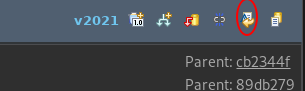

# Git del 3: HJELP!!!

Git er et system med mange muligheter, som ofte innebærer at en del ting kan gå galt.
Her vil jeg prøve å liste opp noen vanlige problemer, og løsningene på dem.

## Merge Conflicts
Noen ganger får ikke git til å merge automatisk.
Dette er typisk når samme fil har blitt endret i samme område i begge branchene vi jobber med.
Da får vi en såkalt merge-konflikt, som betyr at vi manuelt må velge hvordan ting skal ende opp.

### I Eclipse
I Eclipse får vi beskjed om at det er en merge-konflikt med vinduer som dette:


Merk at det står "Conflicting" i *Result*-feltet.
Om du får en merge-konflikt ved en `pull` ser vinduet litt annerledes ut, men du vil uansett få beskjed om at det er en konflikt.

For å løse merge-konflikter gjør du følgende:

1. Finn ut hvilke(n) fil(er) det er konflikter i.
Dette kan du se i *Git Staging*-vinduet:


Her ser vi at `Person.java` er listet opp med `Unstaged Changes`, og med et rødt symbol som tyder på merge-konflikter.
Om man prøver å legge den til på indeksen vil commit-meldinga automatisk oppdateres til å si at det er konflikter i den fila.
La oss åpne fila og se etter disse konfliktene.

2. Finn konflikter. Disse er markert i filene med på denne måten:
```java
<<<<<<< HEAD
// Kode fra målgrena
=======
// Kode fra kildegrena
>>>>>>> ref/til/kildegren
```
Altså har vi to versjoner av koden, og må velge hva som skal stå igjen.
For meg så konflikten ut som dette (merk at dette *ikke* er en del av løsningen på Person-oppgaven i øving 2, det er bare tull):
```java
<<<<<<< HEAD
		email = "meg@deg.no";
=======
		System.out.println(email);
>>>>>>> refs/heads/testForMergeConflict
```
Det betyr at jeg i målgrena har lagt til linja
```java
email = "meg@deg.no";
```
mens jeg på samme linje har lagt til
```java
System.out.println(email);
```
i kildegrena.
Da vet ikke git hva den skal beholde, så vi må bestemme det.

3. Løs konflikter. I praksis betyr dette å fjerne linjene med `<<<<<<`, `========`, og `>>>>>>>`, og passe på at koden som står igjen er rett.
Ofte velger man kun å beholde én av versjonene av koden (f.eks. kunne jeg beholdt kun `System.out.println(email);`), men det er ingen ting i veien for å beholde begge, slette alt, eller til og med skrive inn helt ny kode.
Det viktige er at det som står igjen gir mening.
Ofte er det lurt å teste at koden fungerer etter at du har fikset opp i merge-konflikter.

4. Legg til endringene på indeksen, og commit. Dette gjøres som normalt.
Pass på at *alle* merge-konflikter er fikset før du committer.

### I Terminalen
I terminalen kan du, når du kjører en `git merge`, få et resultat som ligner på følgende:
```
Auto-merging ovinger/src/main/java/encapsulation/Person.java
CONFLICT (content): Merge conflict in ovinger/src/main/java/encapsulation/Person.java
Automatic merge failed; fix conflicts and then commit the result.
```
som sier at det er konflikter i `Person.java`.
Du kan også kjøre en `git status` for å se at den fila er listet under *Unmerged paths*.
Åpne fila i din valgte editor (f.eks. Eclipse), og fiks konflikten som beskrevet under steg 2 og 3 over.
Deretter kjører du
```bash
git add <path_to_conflict_file>
git commit
```

Merk at jeg kjører `git commit` ***uten*** `-m`-argumentet.
Det er fordi merge-commits får automatisk genererte commit-meldinger, som man i de fleste tilfeller bør beholde.
Derfor kan du bare lagre og lukke meldingen du får opp når du kjører kommandoen.
Etter det skal merge-konflikten være løst.

## Jeg har commitet noe jeg ikke ville ha med
Noen ganger gjør vi feil, og det kan være lett å commite noe som ikke skulle vært med.
Kanskje har man endret en metode som man senere fant ut at ikke skulle bli endret, eller la til en fil for mye på indexen før man commitet.

Git lar oss heldigvis løse disse problemene, og vi skal gå gjennom noen måter å gjøre det på her.

### I Eclipse
**1. Resette til en tidligere versjon**
Merk at denne måten å resette en fil på (utover å resette til `HEAD`) kun er trygg dersom grena du jobber med ikke er synkronisert andre steder.

Høyreklikk på fila eller mappa du vil resette, og trykk *Team -> Replace With*.
Her kan du velge *HEAD*, *Index*, osv., eller velge *Branch, Tag, or Reference* eller *Commit...*.
*HEAD* er nyeste commit i branchen du befinner deg.
Velger du *Branch, Tag, or Reference* får du opp et vindu der du velger gren å bytte ut fila med.
Velger du *Commit...* får du opp en liste med commits du kan velge å resette til. Merk at dette endrer filene, men du må commite for å lagre endringen i git.

**2. Git revert**
Revert lar oss resette på en måte som er trygg selv om commiten du vil revertere er synkronisert med andre.
For å gjøre dette, følger du denne fremgangsmåten:

1. Åpne *Git Reflog*-viewet (*Window -> Show View -> Other* og søk etter det)
2. Finn commiten du vil revertere, høyreklikk og velg *Open in Commit Viewer*
3. Øverst i høyre hjørne er det en rad med knapper. Trykk på den der det står *Revert Commit* (se bildet)



4. Gitt at du ikke har endringer som ikke er commitet som vil endres av denne reverteringa, vil dette reversere commiten.
Sjekker du refloggen vil du se at det har blit lagt til en ny commit som heter noe slikt som `Revert "<commit-melding>"`

### I Terminalen


**1. Resette repoet eller enkeltfiler**

Her kan vi bruke kommandoen 
```bash
git reset
```
Uten noen argumenter vil `reset` kun resette indeksen.
Det vil si at filene våre ikke endres, men indeksen tømmes så alle endringer siden forrige commit blir unstaged.

Om vi derimot bruker
```bash
git reset --hard
```
vil alle endringer siden forrige commit fjernes fra filene våre. Merk at det ***IKKE*** er mulig å få disse endringene tilbake, så vær forsiktig med denne kommandoen.

Når vi skriver inn `git reset`, tolker git det egentlig som
```bash
git reset HEAD
```

men i stedet for `HEAD` kan vi her sette inn hvilken som helst commit, f.eks. en av disse
```bash
git reset HEAD~ # Resetter indexen, så endringer blir værende i filene men ikke lagt til i git
git reset --hard HEAD~ # Resetter indexen OG innholdet i filene
```

Disse kommandoene resetter *hele* mappa vi er i til commiten vi spesifiserer.
Om vi bare vil resette en fil, kan man legge på filbanen på slutten, som dette:
```bash
git reset <commit_ref> <filename>
```

Merk at når man resetter enkeltfiler vil indeksen resettes, mens innholdet i filene ikke forandres.
Altså kan man ikke bruke `--hard` i dette tilfellet.
Og da har vi funnet ut hvordan vi resetter en fil til en tidligere commit.

**2. Sjekke ut en fil fra en tidligere commit**
Før vi går til fremgangsmåten, kan det hende du så noe rart.
Jeg sa vi skulle sjekke ut fra *en tidligere commit*.
Så langt har vi bare sett hvordan vi sjekker ut en annen branch, som høres ut som noe helt annet.
Faktum er, derimot, at når vi sjekker ut en annen branch sjekker vi egentlig ut den nyeste commiten i den grena av git-treet vårt.
Navnet på grena er rett og slett en snarvei til denne commiten (som forsåvidt er lagret i fila `.git/refs/head/<branchname>`).
Så for å sjekke ut en annen commit, trenger vi bare å vite hva den commiten heter, som i git betyr at vi må ha *hashen* til commiten.
Den kan vi f.eks. finne ved å se i loggen til git (se guide til dette under Tips og Triks).
Der vil hashen se ut enten slik som dette `95d2e1045c742599522641b5dee1aa2c343b68c8` (full hash) eller forkortet som dette: `252e61a`.
Det er ikke så viktig nøyaktig hvorfor commitene har disse navnene, men det er viktig å vite at de har det.

I tillegg til commit hasher og branch names, har git en spesiell referanse, nemlig `HEAD`. 
`HEAD` er den nyeste commiten i branchen vi er i, og kan være veldig praktisk. 
I tillegg kan vi bruke tilde-karakteren `<commit_ref>~` til å gå til commiten før en gitt commit.
Kombinert kan vi da bruke `HEAD~` for å peke på den nest siste commiten i grena, eller `HEAD~~` for den før det, osv.
Tilsvarende den siste kan vi også skrive `HEAD~2`

For å sjekke ut en fil fra en tidligere commit brukes kommandoen
```bash
git checkout <commit_ref> <filename>
```
Dette endrer innholdet i fila, men ikke hva som er lagt til indeksen i git.
Om du etter dette legger til fila du sjekket ut på indeksen og commiter, vil versjonen av fila fra den versjonen være den som gjelder i den nyeste versjonen av repoet.

**3. Bruke `revert`**

Revert brukes for å lage en *ny* commit som reverserer endringene som kom fra en tidligere commit.
Forskjellen fra `reset` og `checkout` er at vi nå ikke endrer gits historie, men i stedet legger på en ny commit.
Vi bytter heller ikke ut hele fila med versjonen den var før den commiten vi reverter, i stedet reverserer vi bare endringene som ble lagt til i den.
Det betyr at vi beholder endringer som kom *etter* denne commiten.

Kommandoen er
```bash
git revert <commit_ref>
```
