# Git del 2: Git operasjoner

Denne delen vil gå gjennom de forskjellige operasjonene vi kan bruke i git.
Merk at dette kun er et lite knippe av kommandoene som finnes, men det bør holde lenge til å få dere i gang.
Vi viser hvordan kommandoene brukes i Eclipse først, deretter i terminalen.
Kommandoene som gjennomgås er:

Kommando | Beskrivelse
---------|-------------
[Clone](#clone) | Laster ned et repo fra en URI
[Add](#add) | Legg til endringer på indeksen
[Status](#status) | Se hvilke endringer som er gjort, og hva som er lagt til på indeksen
[Commit](#commit) | Lag en ny commit med endringene på indeksen
[Push](#push) | Last opp commitene du har gjort til det eksternte repoet
[Pull](#pull) | Last ned endringer som har blitt gjort på det eksterne repoet
[Checkout](#checkout) | Endre gren
[Merge](#merge) | Merge en gren inn i i en annen

<a name="clone"></a>

## Clone - Hente ned et repo 

Å klone et repo betyr å laste det ned fra en server så man kan begynne å bruke det.
For å klone et repo må du først ha repoets *clone uri*, som typisk er en nettaddresse.
Disse finner du på repoets nettside, som ofte ligger på sider som [GitHub](https://github.com), [Bitbucket](https://bitbucket.org), eller [GitLab](https://gitlab.com).
I dette faget bruker vi en versjon av GitLab som er hostet på NTNU.
Addressa dit er https://gitlab.stud.idi.ntnu.no.

I GitLab kan du gå inn på et repo, f.eks. *students* som er øvingsrepoet vårt.
Der finner du en blå knapp med navn clone.
Trykk på den, så får du opp to lenker, som er *clone uris* for dette prosjektet.
Vi skal bruke den der det står *Clone with HTTPS*., så kopier den.
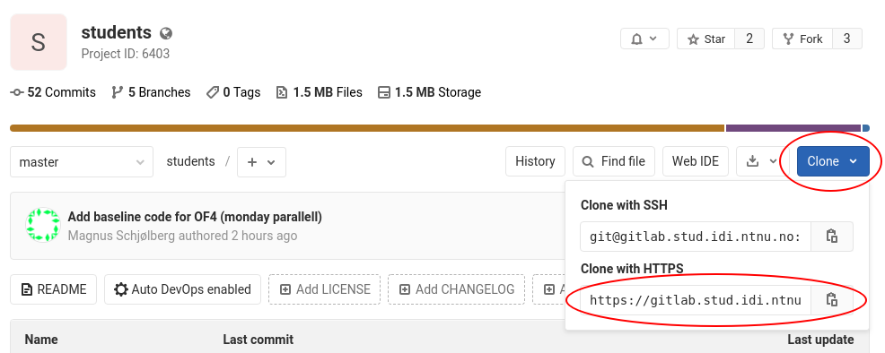

### I Eclipse
For å klone et repo i Eclipse trykker man *File -> Import...*.
I vinduet som kommer opp, i mappen *Git* kan man velge *Projects from Git* og trykke Next.
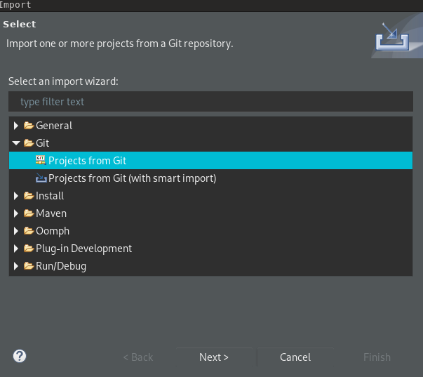

Deretter velger man *Clone URI* og *Next*.
I det neste vinduet skal du lime inn URI-en du kopierte i *URI*-feltet.
Det skal fylle inn *Host*, *Repository Path* og *Protocol* automatisk.
Dersom repoet er passordbeskyttet skriver du også inn brukernavn og passord.
Til slutt trykker du *Next*.
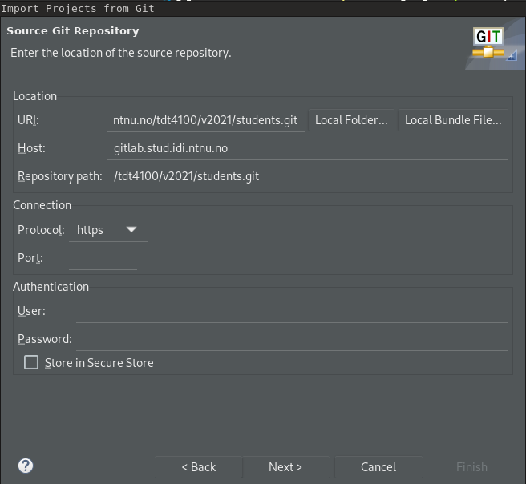

I neste vindu kan du velge hvilke grener du vil laste ned. Sannsynligvis kan du ha alle markert og trykke *Next*.
Neste vindu bør være riktig, så trykk *Next*.
Dersom repoet inneholder Eclipse-prosjekter (som i dette faget) kan du velge *Import Existing Eclipse Projects* og trykke Next.
Ellers må du velge en av de andre, avhengig av repoene.
I siste vindu velger du prosjektene som skal importeres, og trykker *Finish*.

### I Terminalen
For å klone repoet i terminalen, kan du bruke `cd` for å komme til mappa du vil at repoet skal være i (merk at kloning lager en ny mappe i denne mappa).
Så skriver du kommanduen under, og bytter ut `<clone uri>` med den faktiske urien.
```bash
git clone <clone uri>
```

<a name="add"></a>

## Add - legge til filer i indexen

Add legger til filer på *indexen*, som betyr at de endringene vi har gjort i filene ***før vi legger dem til*** vil bli lagret i neste commit.
Om vi bruker add på en fil og så endrer fila, må vi legge den til på nytt for å få med de nye endringene.

### I Eclipse
For å gjøre dette er det enkleste å åpne *Git Staging*-viewet i Eclipse.
Trykk på *Window -> Show View -> Other...*, søk på "git" i vinduet som popper opp og velg *Git Staging* og *Open*.
Nå vil du få et vindu som ligner på dette:

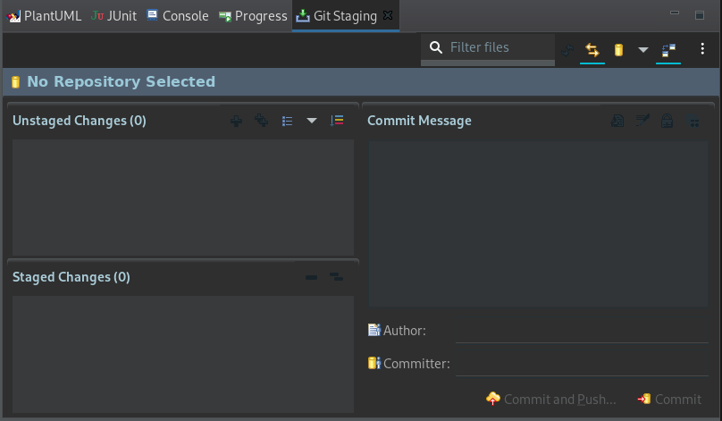

Når du endrer filer vil de komme opp i *Unstaged Changes* i dette vinduet.
For å legge dem til indexen, velger du filen(e) du vil legge til i den ruta, og trykker på det lille grønne pluss-tegnet.
Fila vil nå hoppe til *Staged Changes*, som betyr at endringene er lagt til indexen igjen.

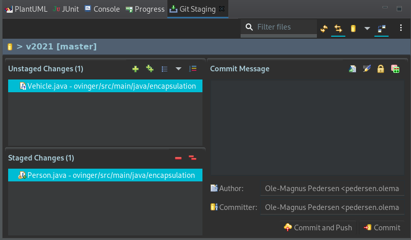

Du kan legge til flere filer, eller fjerne filer fra indexen ved å trykke på det lille røde minus-tegnet.

### I Terminalen
I terminalen bruker du denne kommandoen for å legge filer til indexen (ende `<path_to_file>` til filbanen, f.eks. `src/main/java/encapsulation/Person.java`):
```bash
git add <path_to_file>
```

Du kan bruke normale terminal-wildcards i filnavnet, altså kan du f.eks. skrive 
```bash
git add *
```
for å legge til alle filene i denne mappa.

For å fjerne en fil fra indexen igjen kan du bruke
```bash
git reset HEAD -- <path_to_file>
```
Det denne kommandoen egentlig sier er at fila skal resettes til `HEAD`-revisjonen, som er den nyeste commitede endringen.
Dette fjerner bare fila fra indexen, det endrer ikke innholdet i den lokale fila di.

<a name="status"></a>

## Se status
Det er ofte praktisk å se statusen til git, nemlig hva som, siden forrige commit, har blitt:
- Endret, og lagt til på indexen
- Endret, og ikke lagt til på indexen.

### I Eclipse
*Git Staging*-vinduet viser denne oversikten.
*Unstaged Changes* viser hva som er endret og ikke lagt til indexen, *Staged Changes* hva som er endret og lagt til.

### I Terminalen
Bruk kommandoen
```bash
git status
 ```

 Den lister opp infoen over (i tillegg til litt annen info som vi ikke trenger å bry oss så mye om).

<a name="commit"></a>

## Commit
Som nevnt i teoridelen, så er en commit et checkpoint som lagrer alle endringene du har lagt til på indexen.

### I Eclipse
I *Git Staging*-vinduet kan du skrive en *commit message* i vinduet for det, og trykke *Commit*.
Commit-meldingen bør si noe om hva du har endret denne commiten.

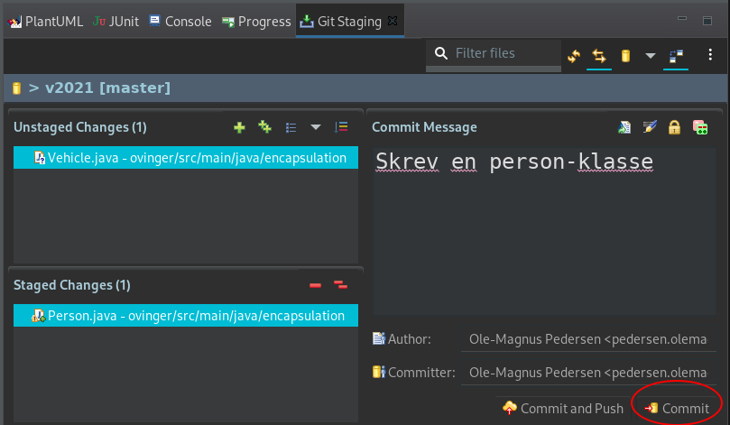

### I Terminalen
Hovedkommandoen for å commite i terminalen er
```bash
git commit
```

Dette vil åpne en teksteditor der du kan skrive inn commit meldinga di, lagre og lukke teksteditoren.
Merk at for en del vil `vim` være standard-teksteditoren terminalen bruker.
Kloke hoder har brukt timesvis på å lukke `vim` første gang, så i stedet for å bruke mye tid på det her kan du sjekke [denne guiden](https://code.likeagirl.io/help-i-was-using-git-to-commit-some-code-and-now-the-window-has-changed-and-i-dont-know-what-s-9348a27e145b).

Om du i stedet vil slippe unna `vim` eller andre teksteditorer, kan du bruke følgende kommando:
```bash
git commit -m "Her kan du skrive en commit-melding"
```
Dette har noen ulemper (spesielt at en commit-melding nå bare kan være en linje), men for dette faget bør det gå helt greit.

<a name="push"></a>

### Push - send oppdateringer til en server
Når du har commitet, er endringene fortsatt bare lagret lokalt hos deg; de blir ikke automatisk synkronisert mot f.eks. GitLab!
For å gjøre dette, må vi bruke kommandoen `push`.

### I Eclipse
I *Git Staging* kan du, i stedet for å trykke *Commit*, velge *Commit and Push*. 
Eventuelt kan du trykke *Push HEAD...* Dersom du ikke har lagt til noe på indexen.
I vinduet som kommer opp bør alt være som det skal, og du kan trykke *Preview >* og så *Push*.

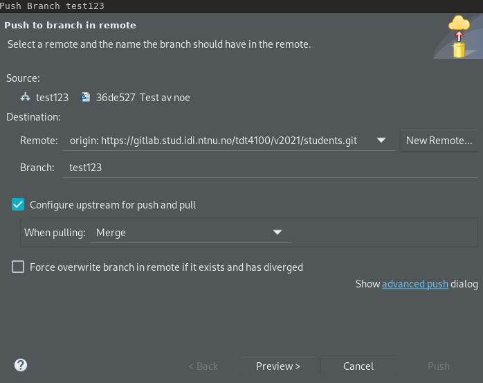

### I Terminalen
I terminalen kan du vanligvis skrive
```bash
git push
```
for å pushe din nåværende branch til serveren.
Unntaket er føste gang du skal pushe den branchen. Da må du i stedet skrive
```bash
git push --set-upstream origin <branch_name>
```
eller
```bash
git push -u origin <branch_name>
```

`--set-upstream`, forkortet til `-u`, setter opp hvilken branch som skal trackes.
I kommandoen er `origin` din referanse til serveren (den settes til `origin` som standard, og man trenger sjeldent å endre den), og `<branch_name>` er navnet på grena.
Dette lager en ny branch på `origin` med navn `branch_name`, og setter din lokale branch til å synkroniseres med denne når du pusher og puller (i git-språk settes denne branchen til din lokale branchs `upstream`).

<a name="pull"></a>

## Pull - oppdatere lokalt repo fra server

Denne kommandoen har dere allerede brukt en del i faget.
`pull` henter ned oppdateringer fra upstream (altså fra serveren).
Teknisk sett gjør `pull` først en `git fetch`, som henter ned oppdateringer, etterfulgt av en `git merge` som kombinerer oppdateringene fra serveren med din lokale gren.
Av denne grunn kan en `pull` føre til en *merge conflict* (se del 3 i denne guiden for hvordan dette løses).

### I Eclipse
Høyreklikk på et prosjekt som er tracket i git og velg *Team* -> *Pull*.
Noen ganger virker det som om du må trykke *Team* -> *Repository* -> *Pull* i stedet.

### I Terminalen
```bash
git pull
```

<a name="checkout"></a>

## Bytte gren
Nå har vi gått gjennom alt man trenger for å jobbe med git, så lenge man holder seg til én gren.
Den store styrken til git er derimot å kunne ha flere grener.
I denne delen skal vi se på:
- Hvordan bytte til en gren du har lokalt
- Hvordan bytte til en gren som er på serveren, men ikke lokalt i ditt repo
- Hvordan lage en ny gren og bytte til den

Alle disse kan gjøres med versjoner av `git checkout`-kommandoen.

### I Eclipse

**1. Bytte til en lokal gren**

Høyreklikk på prosjektet, og velg *Team -> Switch To*.
I menyen ser du en del grener, velg en av dem for å bytte til den.
Om du ikke ser grenen du vil ha kan du trykke på *Other...* og velge den i vinduet der.

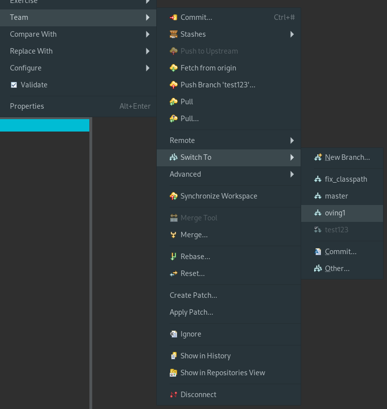

**2. Bytte til en gren på serveren**

Høyreklikk på prosjektet, og velg *Team -> Switch To -> Other...*.
I vinduet som dukker åpner du mappa *Remote Tracking*, velger grena du vil ha, og trykker *Check Out...*.
Velg *Checkout as New Local Branch* i popupen som dukker opp, og trykk *Finish* i det neste vinduet.

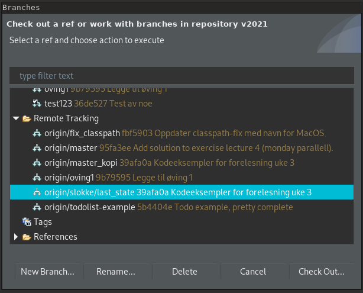

**3. Bytte til en ny gren**
For det første, husk at en ny gren lages ut fra en annen gren, så pass på at du starter i grenen du vil gå ut i fra.
I de aller fleste tilfeller vil dette være `master`/`main`.

Så gjør du følgende:
Høyreklikk på prosjektet, velg *Team -> Switch To -> New Branch...*.
I vinduet kan du velge *Source*, altså hva du brancher ut i fra, og gi et navn til grena.
Resten kan stå som det står, så trykk *Finish*, så blir den nye grena sjekket ut.

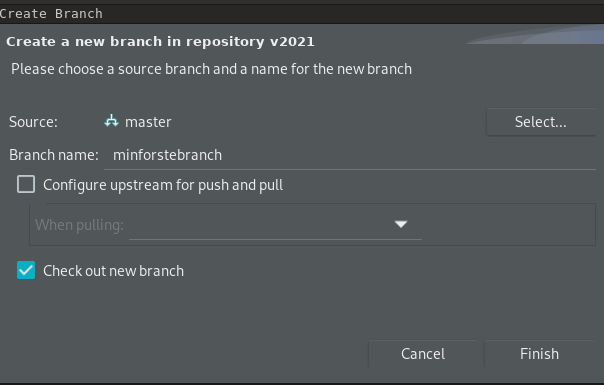

### I Terminalen

**1. Bytte til en lokal gren**

Å bytte til en lokal gren er så enkelt som å skrive inn følgende:
```bash
git checkout <branch_name>
```

**2. Bytte til en gren på serveren**

For å bytte til en remote gren, bruker man nøyaktig samme kommando som over.
Git skjønner selv at den da må lage en ny lokal gren som tracker den på serveren.
Det eneste vi må passe på er at git vet om grena på serveren.
Det kan vi gjøre ved å kjøre en `git fetch` før vi kjører checkout.
Dermed blir kommandoene:
```bash
git fetch
git checkout <remote_branch_name>
```

**3. Lage en ny branch og bytte til den**
For det første: Det er flere måter å lage nye grener på, dette er en måte som lager en ny gren og sjekker den ut med en kommando.
Det gjøres på denne måten:
```bash
git checkout -b <branch_name>
```

Dette er en raskere måte å gjøre følgende på:
```bash
git branch <branch_name> # Lager en ny gren
git checkout <branch_name> # Sjekker ut den nye grena
```

<a name="merge"></a>

## Merge - kombiner grener

Til slutt kommer vi til den store, stygge, ekstremt praktiske delen av git: Hvordan kombinere grener.
Som med så mye annet er det flere måter å gjøre dette på, og for de spesielt interesserte kan det være verdt å lese seg opp på `git rebase`.
I denne guiden holder vi oss allikevel til den metoden som er mest rett frem, nemlig `git merge`.

En merge kombinerer endringene i en gren til en såkalt *merge-commit* som blir lagt til i en annen gren.
Utover det skjer det ingen ting: Begge grenene kan fortsatt jobbes videre på (men ofte velger man å slette grena som merges inn i en annen gren).

For å gjøre denne diskusjonen litt enklere kommer jeg til å referere til kildegren/source branch og målgren/target branch.
Kildegren skal merges inn i målgren.
Det betyr at når vi merget den blå grena inn i master i bildet under, var den blå kildegrena, mens master var målgrena.

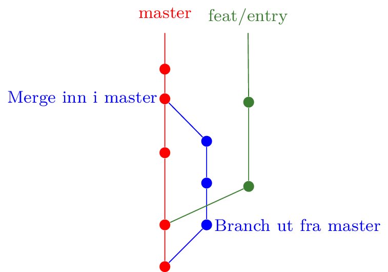

Før vi begynner på beskrivelsen, er det en veldig viktig ting å huske på:
**Det er kun endringer som har blitt commitet som merges inn.**
Det betyr at om du har endringer som du enda ikke har commitet (uavhengig av om de er på indexen eller ikke), må du gjøre en commit før du merger om du vil ha dem med.

### I Eclipse
Sjekk ut mål-grena di (ofte `master`/`main`).
Høyreklikk så på prosjektet, og velg *Team -> Merge...*

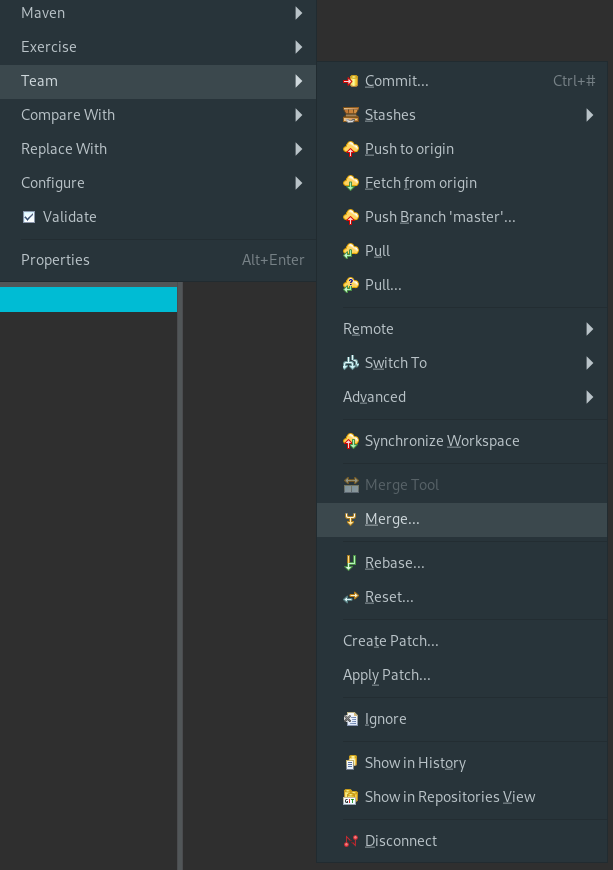

I vinduet som popper opp velger du kildegrena di.
Resten av valgene kan stå som de er, så trykk *Merge*.
Etter det vil du få opp et vindu med resultatet av mergen.
Om det står at det gikk greit, har du fått merget grena.
Om det derimot er *merge conflicts* får ikke git til å merge automatisk, og vi må inn å hjelpe til.
Mer om det senere.

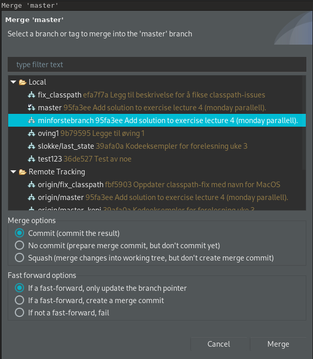

Etter en sukksessfull merge kan du valgfritt slette kildegrena:
*Team -> Advanced -> Delete Branch...*, velg kildegrena og trykk *OK*.

### I Terminalen
Merging i terminalen gjøres ved å bruke kommandoen `git merge` fra målgrena.
Totalt blir det:

```bash
git checkout <target_branch> # Sjekk ut målgren
git merge <source_branch> # Merge inn kildegren
```

Du får beskjed om mergen gikk som den skulle, eller om det var konflikter.
Om det er konflikter må de løses manuelt, det kommer vi straks tilbake til.

Etter en sukksessfull merge kan du valgfritt slette kildegrena:
```bash
git branch -d <source_branch>
```